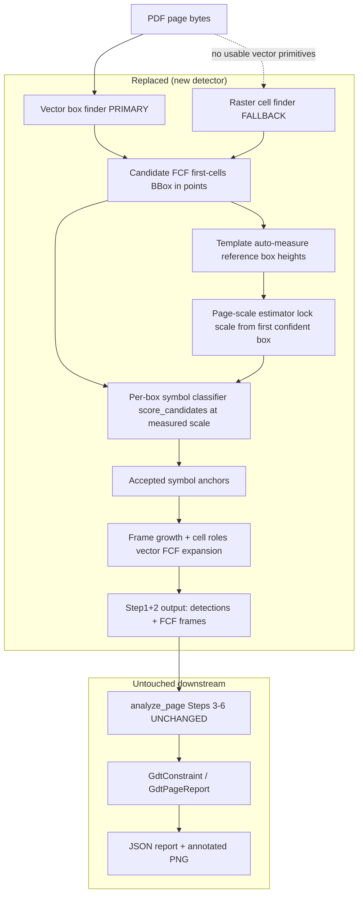

# Design Document: GD&T Geometry-First Detection

## Overview

The production GD&T symbol detector (`GdtTemplateDetector` in `template_detector.py`) scans the
whole page with multi-scale (8) multi-rotation (3) `cv2.matchTemplate` — roughly `28 templates ×
8 scales × 3 rotations ≈ 672` full-page normalized cross-correlations per page. This is the
dominant cost, and it runs serially on Cloud Run (`GDT_WORKERS=1`). It is also imprecise: every
page location is a candidate, so any glyph or table fragment that correlates with a simple symbol
can survive.

This design replaces that step with a **geometry-first, scale-measured, classify-inside-the-box**
detector, built on two architectural pillars taken directly from the domain:

1. **Boxes first.** GD&T symbols only ever appear inside the *first cell* of a feature-control-frame
   (FCF) box. So we find the boxes from PDF vector geometry first, then classify *only inside* the
   first cell of each candidate box. This collapses 672 full-page correlations into a few dozen tiny
   fixed-size (48×48) crop classifications, and it structurally rejects anything that is not a
   box-shaped, FCF-proportioned region.
2. **Measured scale.** The symbol template prints include the surrounding box, so the box is a
   *scale ruler*. When a real FCF cell is found in the drawing, its measured cell height (in points)
   versus the template's own measured box height yields the exact render scale. Because a CAD export
   renders the whole page at one zoom, we lock a single page-level scale from the first confident
   box. This collapses the 8-scale search to **one measured scale** (with a ±5% tolerance band).

The replacement is a direct swap of `analyze_page`'s Step 1 (detect) + Step 2 (expand-to-FCF).
Everything downstream — datum steps, report assembly, annotated rendering, extraction — is preserved
byte-for-byte in its interface. `analyze_page`'s signature and its 5-tuple return contract, and the
`GdtConstraint` / `GdtPageReport` shapes, remain unchanged so the JSON report and annotated PNG keep
working.

This is a replacement (not an A/B toggle), chosen for speed. The design still describes how to
validate before/after on the example folders and how to keep the 103 existing tests green.

---

## Architecture

### Component diagram



### What is replaced vs. what stays

| Concern | Today | After |
| --- | --- | --- |
| `analyze_page` Step 1 (symbol detect) | `GdtTemplateDetector(...).detect()` — 672 full-page correlations | new `detect_geometry_first_frames(...)` — vector box finder + measured-scale classify-inside-box |
| `analyze_page` Step 2 (expand to FCF) | `expand_detections_to_fcf(...)` | frame growth via vector FCF expansion (reuse `expand_fcf_from_detection` / `_grow_frame_from_anchor`) |
| `analyze_page` signature & 5-tuple return | `(GdtPageReport, detections, frames, extractions, datum_defs)` | **unchanged** |
| `Detection` / `FcfFrame` / `GdtConstraint` / `GdtPageReport` shapes | as-is | **unchanged** (new detector emits the same `Detection`/`FcfFrame` objects) |
| `_align_results` key `(class_name, round(score,4))` | as-is | **unchanged** (new detector still sets `class_name` + `score`) |
| Steps 3–6: `extract_datum_cells`, `find_datum_definitions`, `detect_document_datum_feature_indicators`, `resolve_outlined_datum_references` | as-is | **unchanged** |
| `render_annotated_page` / `save_report` / `save_visualization` | as-is | **unchanged** |
| `scales` / `rotations` params | drive the 8×3 search | become effectively **no-ops** for the primary path; only feed the raster fallback (see Backward compatibility) |

### Data flow (sequence)

```mermaid
sequenceDiagram
    participant AP as analyze_page
    participant DET as detect_geometry_first_frames
    participant VF as vector_fcf_cells
    participant TM as template box measurer
    participant SC as page-scale estimator
    participant CL as score_candidates (classifier)
    participant EX as frame growth / FCF expander

    AP->>DET: pdf_bytes, page_index, template_root
    DET->>VF: page.get_drawings() -> candidate first-cells (BBox pt)
    alt no usable vector primitives
        DET->>DET: fall back to _cell_rectangles_from_raster (raster)
    end
    DET->>TM: measure each template's own box height (px) [cached]
    DET->>CL: score first-cell crops at symbol_dpi=300
    CL-->>DET: best_class/score/margin/negative_control per cell
    DET->>SC: cell_height_px / template_box_height_px -> scale; lock from 1st confident box
    DET->>EX: grow FCF rightward + assign cell roles
    EX-->>DET: FcfFrame list + first-cell Detection list
    DET-->>AP: (detections, frames)  # same shapes as old Step 1+2
    AP->>AP: Steps 3-6 unchanged -> GdtPageReport
```

### How measured scale removes the 8-scale search

The old detector renders each template at 8 scales because it does not know the drawing's zoom. In
the new path the zoom is *measured*: the classifier crop is a real FCF cell whose height in points is
known from geometry, and each template's box height in template-pixels is known from auto-measure.
Their ratio is the exact render scale, so we only ever compare at one scale. The classifier
(`symbol_classifier.py`) already canonicalizes both the crop and the templates to a fixed 48×48 form
(`canonicalize`), so scale consistency is enforced by that canonicalization; the measured page scale
is used to size the *source crop* correctly (see Low-Level §"Feeding measured scale into the
classifier") so the 48×48 canvas is filled by the symbol and not by surrounding whitespace or
neighbouring cells.

### How rotation is handled

Vector FCF boxes are axis-aligned, and the whole drawing renders upright, so candidate first-cells
are upright by construction. Rotation therefore drops out of the primary path: we classify upright
crops only. We keep an optional minimal `0 / ±90` check *inside a candidate cell* only if calibration
on the example folders shows rotated FCFs occur (rare for CAD exports); this is a per-crop rotation of
the tiny 48×48 canonical form, not a full-page rotated correlation, so it stays cheap.

### Fallback strategy (rare non-vector page)

Input PDFs are vectorized CAD exports, so `page.get_drawings()` returns exact `l`/`re` primitives and
is the primary box source. If a page yields no usable vector primitives (scanned/flattened page), the
detector falls back to the existing raster cell finder `_cell_rectangles_from_raster` (260 DPI
morphology) from `symbol_anchor_detector.py`. The fallback feeds the *same* classify-inside-box and
frame-growth stages; only the cell source differs.

### Backward compatibility

- `analyze_page(pdf_bytes, *, page_index, template_root, dpi, score_threshold, scales, rotations,
  pdf_name, max_workers)` keeps its exact signature.
- It keeps returning `(GdtPageReport, List[Detection], List[FcfFrame], List[FcfExtraction],
  List[DatumDefinition])`.
- `scales` / `rotations` become effectively no-ops for the primary path. To avoid a silent behaviour
  change we keep accepting them and route them only to the raster fallback's optional rotation check.
  This must be called out in the docstring so callers are not surprised.
- `score_threshold` is remapped: the new anchor acceptance uses the classifier's `min_score` /
  `min_margin` / `negative_margin` (see calibration). `score_threshold` is retained for signature
  compatibility and used as the reported `Detection.score` floor; its default `0.74` no longer drives
  full-page correlation.

---

## Components and Interfaces

### Component 1: Vector box finder (PRIMARY)

**Purpose**: Enumerate small FCF-cell rectangles (candidate first-cells) directly from PDF vector
primitives, resolution-independent.

**Reuses**: `candidate_detector_v2.audit_and_normalize_vector_primitives`, `_merge_h`, `_merge_v`
(vector edge machinery); `fcf_expander.extract_page_lines` as the seed line source; geometry
constants from `fcf_expander` (`MIN_FCF_HEIGHT=8.0`, `MAX_FCF_HEIGHT=22.0`, `MIN_CELL_WIDTH=5.0`,
`MAX_DATUM_CELL_WIDTH=18.0`, `LINE_TOLERANCE=2.0`). Emits `detector.BBox` in points.

**Interface**:
```python
def vector_fcf_cells(
    page: "fitz.Page",
    *,
    min_height_pt: float = 8.0,     # MIN_FCF_HEIGHT
    max_height_pt: float = 22.0,    # MAX_FCF_HEIGHT
    min_width_pt: float = 5.0,      # MIN_CELL_WIDTH
    max_width_pt: float = 34.0,     # first cell is compact (symbol cell)
    aspect_range: tuple[float, float] = (0.30, 3.50),
    endpoint_tolerance_pt: float = 2.0,  # LINE_TOLERANCE
) -> tuple[list[BBox], dict]: ...
```

**Responsibilities**:
- Normalize `l`/`re` (and axis-aligned `qu`) primitives into merged H/V edges (reuse V2 machinery).
- Enumerate enclosed small rectangles that pass the FCF-cell geometry filters (height 8–22pt,
  compact width, aspect band, enclosed-border check analogous to `_cell_rectangles_from_raster` but
  sourced from vector edges).
- Return candidate first-cell `BBox`es (points) + an audit dict for diagnostics.

### Component 2: Raster cell finder (FALLBACK)

**Purpose**: Provide candidate cells when a page has no usable vector primitives.

**Reuses**: `symbol_anchor_detector._cell_rectangles_from_raster` **as-is** (260 DPI morphology,
enclosed-border check, `_dedup_boxes`).

**Interface** (existing):
```python
def _cell_rectangles_from_raster(
    pdf_bytes: bytes, *, page_index: int, dpi: int = 260, ...
) -> tuple[list[BBox], dict]: ...
```

### Component 3: Template auto-measure

**Purpose**: For each template PNG, detect its own enclosing box rectangle and record the box height
(and inner cell height) in template-pixels — the per-template *reference box height* used for scale.

**Interface**:
```python
@dataclass(frozen=True)
class TemplateBoxMetric:
    class_name: str
    template_name: str
    box_height_px: float     # measured outer/enclosing rectangle height
    cell_height_px: float    # inner cell height (box minus border thickness)
    ok: bool                 # False if no rectangle could be measured

def measure_template_box(image_gray: "np.ndarray") -> TemplateBoxMetric: ...

def build_template_box_metrics(template_root: str | Path) -> dict[str, TemplateBoxMetric]: ...
```

**Responsibilities**:
- Do NOT rely on template metadata or a known DPI. Measure the box from the image pixels.
- Handle the case where the box is the outermost contour (border coverage / largest enclosing rect).
- Cache results per `template_root` (measured once, reused across pages).

### Component 4: Page-scale estimator

**Purpose**: Convert a measured cell height to a render scale and lock a single page-level scale from
the first high-confidence box.

**Interface**:
```python
@dataclass
class PageScaleLock:
    scale: float             # measured render scale (page px per template px, normalized)
    locked: bool
    tolerance: float = 0.05  # +/-5% band
    source_anchor_id: str | None = None

def measure_scale(cell_height_px: float, template_box_height_px: float) -> float: ...

def lock_page_scale(evidences: Sequence["SymbolAnchorEvidence"], metrics: Mapping) -> PageScaleLock: ...
```

### Component 5: Per-box symbol classifier

**Purpose**: Classify the symbol inside each candidate first cell at the measured scale.

**Reuses**: `symbol_classifier.load_template_catalog`, `render_page_gray`, `score_candidates`
**as-is** (48×48 canonicalization, 5 components blended 40% appearance + 60% shape, negative_controls
rejection). Invoked via `symbol_anchor_detector._score_anchor_cells` (which wraps `score_candidates`
and applies `min_score` / `min_margin` / `negative_margin`).

### Component 6: Frame growth + cell roles

**Purpose**: Grow an accepted symbol anchor into a full FCF and assign cell roles.

**Reuses**: `symbol_anchor_detector._grow_frame_from_anchor`, `_same_row`, `_dedup_boxes`; and/or
`fcf_expander.expand_fcf_from_detection` + `_assign_cell_roles` (cell 0 = symbol; trailing narrow
≤18pt cells = datum; middle = tolerance). Emits `FcfFrame`.

---

## Data Models

### `Detection` (unchanged — from `template_detector.py`)
The new detector emits `Detection` objects with the same fields so `_align_results` and
`render_annotated_page` keep working. Key fields set by the new path:
```python
Detection(
    class_name=best_class,          # from classifier
    template_name=best_template,    # from classifier
    score=best_score,               # classifier best_score (drives _align_results key)
    x, y, width, height,            # first-cell bbox in points
    scale=measured_scale,           # measured page scale (not a searched scale)
    rotation=0,                     # upright by construction
    pixel_bbox=(...),
)
```

### `FcfFrame` / `FcfCell` (unchanged — from `fcf_expander.py`)
`_align_results` keys frames by `(frame.class_name, round(frame.detection_score, 4))`; the new
detector must set `FcfFrame.class_name` and `FcfFrame.detection_score` to match the emitted
`Detection`.

**Validation rule (critical for `_align_results`)**: each emitted `FcfFrame.detection_score` MUST
equal its paired `Detection.score` (same float), otherwise the `(class_name, round(score,4))` join
drops the frame. The new detector produces detection+frame in the same loop, so it sets both from one
value.

### `TemplateBoxMetric`, `PageScaleLock`
As defined above (new, internal to the detector; not serialized into the report).

---

## Algorithmic Pseudocode

### New production detector: `detect_geometry_first_frames`

```python
def detect_geometry_first_frames(
    pdf_bytes: bytes,
    *,
    page_index: int = 0,
    template_root: str = "assets/gdt/templates",
    symbol_dpi: int = 300,
    scale_tolerance: float = 0.05,
    min_score: float = 0.46,        # to be calibrated
    min_margin: float = 0.025,      # to be calibrated
    negative_margin: float = 0.035, # to be calibrated
    raster_fallback_dpi: int = 260,
) -> tuple[list[Detection], list[FcfFrame], dict]:
    """Return the SAME shape as analyze_page Step 1 (detections) + Step 2 (frames)."""
```

**Preconditions**: `pdf_bytes` is a valid PDF; `template_root` contains the 13 class folders.
**Postconditions**: returns `(detections, frames, audit)` where every `frame.detection_score` equals
its paired `detection.score`; all boxes are axis-aligned and upright.

```
ALGORITHM detect_geometry_first_frames(pdf_bytes, page_index, template_root, ...)
BEGIN
  templates      <- load_template_catalog(template_root)             # classifier catalog (reuse)
  box_metrics    <- build_template_box_metrics(template_root)        # auto-measure, cached

  OPEN doc; page <- doc[page_index]

  # --- Cell source: vector primary, raster fallback ---
  cells_pt, vaudit <- vector_fcf_cells(page)
  IF cells_pt is empty THEN
      cells_pt, raudit <- _cell_rectangles_from_raster(pdf_bytes, page_index=page_index,
                                                        dpi=raster_fallback_dpi)   # reuse
      source <- "raster_fallback"
  ELSE
      source <- "vector_primary"

  IF cells_pt is empty THEN RETURN ([], [], audit_with(source, "no_cells"))

  # --- Classify inside each first-cell (reuse _score_anchor_cells wrapping score_candidates) ---
  evidence, accepted <- _score_anchor_cells(pdf_bytes, page_index=page_index, boxes=cells_pt,
                                            templates=templates, symbol_dpi=symbol_dpi,
                                            min_score=min_score, min_margin=min_margin,
                                            negative_margin=negative_margin)

  IF accepted is empty THEN RETURN ([], [], audit_with(source, evidence))

  # --- Lock one page scale from the first high-confidence accepted box ---
  scale_lock <- lock_page_scale(evidence, box_metrics)   # cell_height_px / template_box_height_px
  ASSERT scale_lock.locked  # else proceed unscaled but record warning

  # --- Grow frames + build Detection/FcfFrame pairs with SHARED score ---
  h_lines, v_lines <- extract_page_lines(page)           # reuse fcf_expander
  detections <- []; frames <- []
  FOR each anchor IN accepted DO
      chain <- _grow_frame_from_anchor(anchor, cells_pt)  # reuse; rightward growth
      IF len(chain) < 2 THEN CONTINUE                      # need symbol + >=1 cell

      first <- chain[0]                                    # symbol cell bbox (points)
      cls   <- anchor.best_class ; sc <- anchor.confidence_score

      det <- Detection(class_name=cls, template_name=anchor.best_template, score=sc,
                       x=first.x0, y=first.y0, width=first.width, height=first.height,
                       scale=scale_lock.scale, rotation=0, pixel_bbox=to_px(first, symbol_dpi))

      frame <- expand_fcf_from_detection(first.x0, first.y0, first.width, first.height,
                                         h_lines, v_lines, class_name=cls, detection_score=sc)
      IF frame is None THEN
          frame <- frame_from_chain(chain, cls, sc)        # fallback: build FcfFrame from grown chain
      _assign_cell_roles(frame.cells)                      # reuse

      detections.append(det); frames.append(frame)

  detections, frames <- dedup_paired(detections, frames)   # reuse _dedup_boxes semantics by frame_bbox
  RETURN (detections, frames, audit)
END
```

### `analyze_page` Step 1+2 swap

```
# BEFORE
detections <- GdtTemplateDetector(template_root, dpi, scales, rotations,
                                  score_threshold, max_workers).detect(pdf_bytes, page_index)
frames     <- expand_detections_to_fcf(pdf_bytes, detections, page_index)

# AFTER (Steps 3-6 unchanged)
detections, frames, _audit <- detect_geometry_first_frames(pdf_bytes, page_index=page_index,
                                                            template_root=template_root)
# scales/rotations are accepted but only routed to the raster fallback's optional rotation check.
```

### Template auto-measure

```
ALGORITHM measure_template_box(image_gray)
INPUT : grayscale template image (box print INCLUDES the surrounding rectangle)
OUTPUT: TemplateBoxMetric(box_height_px, cell_height_px, ok)
BEGIN
  norm   <- normalize polarity so ink is dark on light (reuse normalize_gray semantics)
  binary <- threshold_inv(norm)                       # ink = white
  contours <- findContours(binary, RETR_EXTERNAL)     # outermost first

  # The box is typically the largest enclosing rectangle / outermost contour.
  best <- None
  FOR c IN contours DO
      x,y,w,h <- boundingRect(c)
      IF w < 4 OR h < 4 THEN CONTINUE
      coverage <- border_coverage(binary, x,y,w,h)    # fraction of 4 sides that are ink
      IF coverage >= 0.5 AND (best is None OR w*h > best.area) THEN best <- rect(x,y,w,h)

  IF best is None THEN
      # Fallback: bounding box of all ink is the box (box is the outermost contour)
      best <- bbox_of_all_ink(binary)
      IF best is None THEN RETURN TemplateBoxMetric(..., box_height_px=0, ok=False)

  border_px   <- estimate_border_thickness(binary, best)   # ~stroke width
  box_height  <- best.h
  cell_height <- max(1.0, best.h - 2*border_px)
  RETURN TemplateBoxMetric(box_height_px=box_height, cell_height_px=cell_height, ok=True)
END
```

**Preconditions**: template print includes the surrounding box.
**Postconditions**: `ok=True` ⟹ `box_height_px > 0` and `0 < cell_height_px <= box_height_px`.

`build_template_box_metrics(template_root)` iterates `root/<class>/*.png` (same asset dir as
`load_template_catalog` / `load_templates`), calls `measure_template_box` per image, and returns a
map keyed by `(class_name, template_name)`; results are cached per `template_root`.

### Scale measurement + page-level lock

```
ALGORITHM measure_scale(cell_height_px, template_box_height_px)
BEGIN
  ASSERT template_box_height_px > 0
  RETURN cell_height_px / template_box_height_px
END
```

```
ALGORITHM lock_page_scale(evidences, box_metrics)
INPUT : accepted anchor evidences (each has best_class, best_score, detected cell height in px),
        per-template box metrics
OUTPUT: PageScaleLock
BEGIN
  ordered <- sort evidences by best_score DESC        # most confident first
  FOR e IN ordered WHERE e.accepted DO
      m <- box_metrics[(e.best_class, e.best_template)]
      IF NOT m.ok THEN CONTINUE
      s <- measure_scale(detected_cell_height_px(e), m.box_height_px)
      RETURN PageScaleLock(scale=s, locked=True, tolerance=0.05, source_anchor_id=e.anchor_id)
  RETURN PageScaleLock(scale=1.0, locked=False)       # no confident box; proceed unscaled + warn
END
```

- The locked scale applies page-wide (single zoom assumption).
- Later anchors whose implied scale falls outside `scale ± 5%` are demoted (evidence records the
  mismatch) rather than silently accepted — this suppresses spurious matches at the wrong scale.

### Feeding measured scale into the classifier

The classifier renders the page at `symbol_dpi=300` and crops the cell interior
(`crop_cell_interior`) using the cell `BBox` in points × `zoom`. Because the cell `BBox` already comes
from geometry (its height in points is real), the crop is inherently at the drawing's true scale; the
48×48 `canonicalize` step then makes crop and template scale-consistent. The measured page scale is
used to (a) validate that the cell height is consistent with a real FCF cell before classifying
(reject cells whose implied scale is off-band), and (b) size the crop inset so the symbol fills the
canonical canvas the same way the template does. No per-scale re-rendering is needed.

---

## Correctness Properties

### Property 1: Classifier invocation count is geometry-bounded

∀ page: number of classifier invocations = number of candidate first-cells (a few dozen), never a
function of `scales × rotations × templates`.

### Property 2: Emitted detection and frame share a score

∀ emitted pair (det, frame): `frame.detection_score == det.score` (so `_align_results` joins them).

### Property 3: Only FCF-geometry cells are classified

∀ candidate cell classified: it passed the FCF geometry filters (height 8–22pt, aspect band,
enclosed border) ⟹ no full-page location is classified.

### Property 4: Accepted anchors agree with the locked page scale

∀ accepted anchor with a locked page scale: `|measure_scale(anchor) − page_scale| ≤ 0.05 ×
page_scale`.

### Property 5: measure_scale is well-defined iff the template box is measurable

measure_scale is well-defined ⟺ `template_box_height_px > 0` (guaranteed by `TemplateBoxMetric.ok`).

### Property 6: Raster fallback preserves downstream stages

Fallback: `vector_fcf_cells` empty ⟹ raster cell finder is used ⟹ downstream stages identical.

### Property 7: Backward compatibility of analyze_page

Backward compat: `analyze_page` return arity == 5 and element types unchanged.

---

## Error Handling

| Scenario | Condition | Response | Recovery |
| --- | --- | --- | --- |
| No vector primitives | `vector_fcf_cells` returns `[]` | switch to `_cell_rectangles_from_raster` | continue with raster cells |
| No cells at all | vector + raster both empty | return `([], [], audit)` | `analyze_page` yields 0 constraints (valid empty report) |
| Template box unmeasurable | `TemplateBoxMetric.ok == False` for a class | skip that template for scale-lock; still usable for classification | lock scale from another confident anchor |
| No confident box to lock scale | all anchors rejected or `ok=False` | `PageScaleLock(locked=False, scale=1.0)` + audit warning | classify unscaled (canonicalize still normalizes) |
| Frame growth fails | `_grow_frame_from_anchor` yields <2 cells or `expand_fcf_from_detection` returns None | drop anchor OR build `FcfFrame` from grown chain | prefer chain-built frame; else skip |
| Score/frame key mismatch | defensive | assert `frame.detection_score == det.score` at emit | construct both from one score value |

---

## Testing Strategy

### Unit tests (add under `tests/`, run in `.venv_cadtest`)
- `measure_template_box`: synthetic template with a known box → returns expected `box_height_px`
  within tolerance; box-as-outermost-contour case; unmeasurable image → `ok=False`.
- `measure_scale` / `lock_page_scale`: ratio correctness; picks highest-confidence measurable anchor;
  `±5%` band demotion of off-scale anchors; `locked=False` path.
- `vector_fcf_cells`: on a small synthetic vector FCF page → returns the expected first-cell BBox;
  geometry filters reject too-tall / wrong-aspect / non-enclosed rectangles.
- Contract test: `detect_geometry_first_frames` output satisfies `frame.detection_score == det.score`
  for every pair, and emits `Detection`/`FcfFrame` instances (type checks).

### Integration tests
- `analyze_page` returns a 5-tuple with unchanged element types on a sample PDF; `GdtConstraint` /
  `GdtPageReport` `to_dict()` schema unchanged (snapshot compare of keys).
- Datum steps (Steps 3–6) still run unchanged given the new detector output.

### Property-based testing
- **Library**: Hypothesis (Python).
- Properties: for randomized synthetic FCF geometries, classifier-invocation count is independent of
  `scales`/`rotations`; scale-lock always within band; emitted score-key invariant holds.

### Regression / validation harness (before vs after)
- Run `run_all_examples.py` over `cads_docs_examples/*` before and after the swap; compare GD&T
  detection counts and quality per folder.
- Primary drawing: **folder 45 (part 113891052)**, known to contain **25 GD&T constraints** per the
  last objective run — confirm the new path recovers a comparable count/quality (target: ≥ prior
  quality, ideally recovering all 25).
- Run the existing suite: `cd <repo root> && PYTHONPATH=CloudRun_functions/pipeline
  .venv_cadtest/bin/python -m pytest tests/ -q` — the **103 passing** tests must stay green, or any
  change is made deliberately and documented (e.g., tests that assert on the old multi-scale search).

### Threshold calibration plan
The anchor detector's thresholds are currently **uncalibrated** (`min_score=0.46`, `min_margin=0.025`,
`negative_margin=0.035`, from `_score_anchor_cells`; `symbol_anchor_detector` is marked
`DIAGNOSTIC_ONLY`). As part of the swap these MUST be validated/tuned:
- Sweep `min_score` / `min_margin` / `negative_margin` on labelled example folders (folder 45 as the
  anchor case) to maximize recall of the 25 known constraints while suppressing table/glyph
  false positives.
- Record chosen values and the sweep evidence; promote `symbol_anchor_detector` out of
  `DIAGNOSTIC_ONLY` only after calibration passes on the example set.
- Keep `scale_tolerance=0.05` unless calibration shows CAD zoom variance requires widening.

## Performance Considerations

- Cost model shifts from `~672` full-page NCCs to `~N_cells` (a few dozen) fixed 48×48 classifications
  plus one `page.get_drawings()` parse and one 300-DPI render. Expected large speedup on the serial
  Cloud Run path (`GDT_WORKERS=1`).
- Template box metrics are measured once per `template_root` and cached.
- Vector parse is resolution-independent; the only raster render on the primary path is the single
  `symbol_dpi=300` page render already used by the classifier.

## Security Considerations

No new external inputs or network calls. PDFs are parsed with PyMuPDF exactly as today. No change to
the trust boundary; `pdf_bytes` remains untrusted input handled by existing rendering code.

## Dependencies

Existing only — no new dependencies:
- PyMuPDF (`fitz`) — vector primitives / rendering.
- OpenCV (`cv2`) + NumPy — classification, template box measurement.
- Hypothesis — property-based tests (add as a dev/test dependency if not already present).

Reused modules (build on, do not reinvent):
`gdt_report.py` (`analyze_page`, `GdtConstraint`, `GdtPageReport`, `render_annotated_page`),
`symbol_anchor_detector.py` (`detect_symbol_anchored_frames`, `_score_anchor_cells`,
`_grow_frame_from_anchor`, `_same_row`, `_dedup_boxes`, `_cell_rectangles_from_raster`,
`SymbolAnchorEvidence`, `_candidate_for_single_cell`), `symbol_classifier.py`
(`load_template_catalog`, `render_page_gray`, `score_candidates`, `canonicalize`,
`crop_cell_interior`), `fcf_expander.py` (`extract_page_lines`, `expand_fcf_from_detection`,
`_assign_cell_roles`, `FcfFrame`, `FcfCell`, geometry constants), `candidate_detector_v2.py`
(`audit_and_normalize_vector_primitives`, `vector_high_recall_proposals`, `_merge_h`, `_merge_v`),
`detector.py` (`BBox`, `GdtCell`, `GdtFrameCandidate`).
